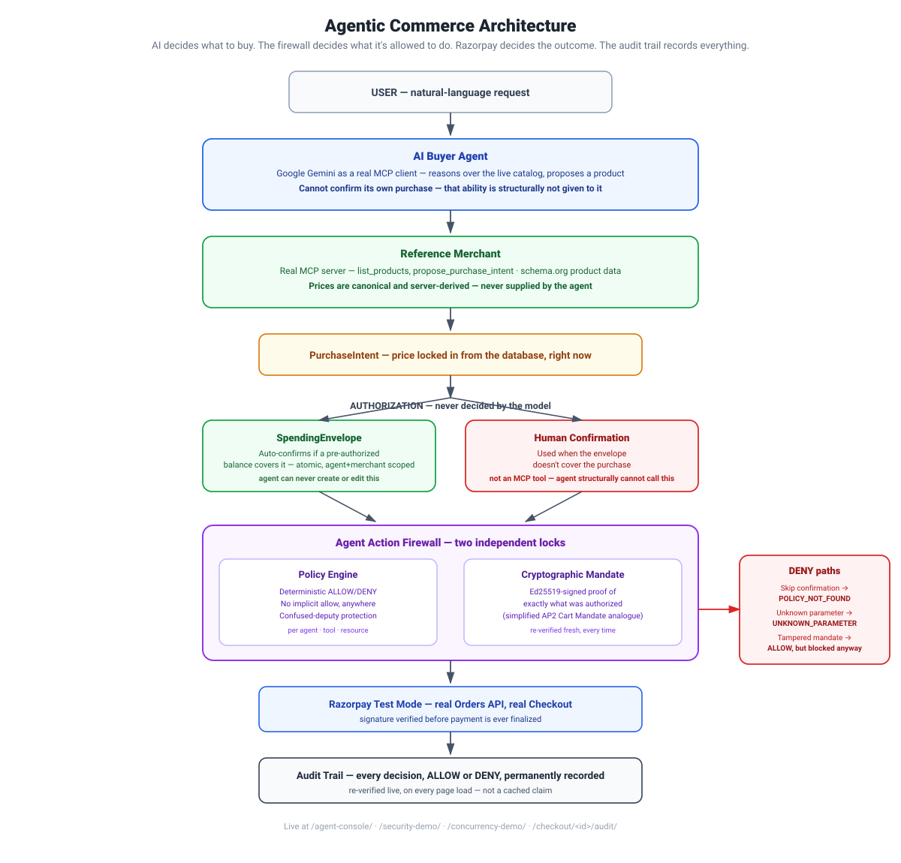

# Envelope — Agentic Commerce with Cryptographic, Bounded Authorization

**Built for Razorpay AI Buildathon 2026 — Track 1: AI Growth & Agentic Commerce**

> AI decides what it wants to buy. The merchant determines what is actually true and available. The authorization system determines what the agent is allowed to do. Razorpay determines the payment outcome. The system records the proof.



---

## Table of Contents

- [The Problem: Software Wasn't Built to Be Seen by Agents](#the-problem-software-wasnt-built-to-be-seen-by-agents)
- [What This Delivers Against Track 1](#what-this-delivers-against-track-1)
- [System Overview](#system-overview)
- [Purchase Flow](#purchase-flow)
- [Delegated Authorization: SpendingEnvelope](#delegated-authorization-spendingenvelope)
- [Security Guarantees](#security-guarantees)
- [Live Interfaces](#live-interfaces)
- [What We Don't Claim](#what-we-dont-claim)
- [What's Next](#whats-next)
- [Tech Stack](#tech-stack)
- [Running It Locally](#running-it-locally)
- [Test Suite](#test-suite)
- [Repository History](#repository-history)
- [Credits](#credits)

---

## The Problem: Software Wasn't Built to Be Seen by Agents

Almost every storefront on the internet today is built for a human with a mouse — buttons, layouts, colors an AI can't even perceive. An agent can't click "Buy Now." It doesn't see a page; it needs the page to describe itself.

So this project starts with a simple question: **how do you make a store actually visible to an agent, well enough that it can shop and buy on your behalf — without ever losing control over what it's allowed to spend?**

The answer has two halves, and this repo builds both:

1. **Visibility** — the storefront describes every product the same way search engines and shopping assistants already read the web: structured, machine-readable data (schema.org), exposed through a small set of real, callable tools (MCP — Model Context Protocol). No chat window pretending to be a checkout. Real functions, real doors.
2. **Control** — every one of those doors sits behind a deterministic authorization firewall the agent cannot see around, bypass, or reason its way past. The agent can look, decide, and propose. It can never authorize its own spending.

## What This Delivers Against Track 1

Track 1 asks for exactly one thing, stated plainly: every money action explainable, bounded, and gated — with the audit trail shown, and at least one failure handled gracefully. This project doesn't just meet that bar; it demonstrates it live, from five independent angles:

| Requirement | Where it lives |
|---|---|
| **Explainable** | Every decision — allow or deny — is logged with a policy ID and a reason code, visible on the audit page |
| **Bounded** | SpendingEnvelope enforces a hard, pre-authorized spending ceiling, atomically, per agent and merchant |
| **Gated** | Two independent locks — a deterministic Policy Engine and a cryptographic Purchase Mandate — sit in front of every spend |
| **Audit trail, shown** | `/checkout/<intent_id>/audit/` — a live decision timeline that re-verifies the cryptographic signature on every page load, not a cached record |
| **One failure, handled gracefully** | Five, actually: skip-confirmation, unknown-parameter, tampered-mandate, tampered-amount, and envelope-exhaustion — each demoable live, each resolving cleanly instead of crashing or silently failing |

## System Overview

| System | What it is |
|---|---|
| **1. Agent Action Firewall** | A deterministic ALLOW/DENY policy engine, extended with a cryptographic Purchase Mandate and a delegated-authority SpendingEnvelope layer |
| **2. Reference Merchant** | A real storefront with schema.org machine-readable product data and MCP tools for catalog discovery |
| **3. AI Buyer Agent** | A real Gemini-powered agent using a real MCP client, with a hard, non-bypassable human-confirmation gate and automated payment handoff |
| **4. Agent Console** | A live, browser-based visualization of the agent's pipeline — every stage that's already happening in the backend, made watchable end-to-end |

## Purchase Flow

```
Search catalog (MCP: list_products)
  → Propose purchase intent (server-derived canonical price, never agent-supplied)
  → Product-fit confirmation (human may reject and force a new search)
  → Authorization (see below — envelope auto-confirm, or manual gate)
  → Cryptographic Purchase Mandate signed (Ed25519)
  → create_order (real Razorpay test-mode order)
  → Checkout (human payment — Razorpay requires this; not automatable even in test mode)
  → finalize_payment (verifies Razorpay signature, idempotent)
  → Live audit trail (re-verifies the mandate on every page load)
```

## Delegated Authorization: SpendingEnvelope

Modeled on NPCI's real **UPI Reserve Pay** / Single Block Multiple Debits policy (block funds once, up to ₹10,000, valid 90 days, one block per merchant — real published rules). Additive to, never a replacement for, the manual confirmation gate:

- **Scope:** one envelope per agent + merchant — a real `Merchant` foreign-key relationship, not a hardcoded string, proven with a cross-merchant denial test.
- **Auto-confirm:** if an active, unexpired envelope has enough remaining balance for a proposed purchase, the system authorizes it automatically — no human click. If not, it falls back cleanly to the manual gate, with an explicit reason.
- **Concurrency safety:** the balance check-and-decrement is a single atomic conditional `UPDATE`, not a Python read-then-write — proven with a real multithreaded test, two real OS threads racing for a balance that can only cover one. Watch it happen live at `/concurrency-demo/`.
- **Hold → capture → release lifecycle:** auto-confirming a purchase places a `HELD` debit against the envelope. A successful payment **captures** it permanently; a failed payment **releases** it, atomically and exactly once. We found the need for this ourselves, mid-build, by testing the failure path rather than assuming the happy path was the whole story.
- **Structurally unreachable by the agent:** creating, extending, or revoking an envelope is never an MCP tool — verified by a test asserting no such tool exists in the registry at all.
- **A genuine step beyond the real UPI Reserve Pay:** NPCI's block is centrally trusted and opaque; ours is independently, cryptographically verifiable — the same mandate pattern used for individual purchases, applied to the pre-authorization itself.

## Security Guarantees

Live at `/security-demo/` — four real attacks run through the actual authorization dispatch path, a fresh disposable agent/task/purchase created per run, nothing scripted:

1. **Skip Confirmation** — attempt `create_order` with no human confirmation → `DENY` / `POLICY_NOT_FOUND`.
2. **Unknown Parameter** — inject an undeclared parameter → `DENY` / `UNKNOWN_PARAMETER`.
3. **Tampered Mandate** — confirm normally, then edit the stored mandate payload directly in the database → the Policy layer still says `ALLOW` (its scope genuinely matches), but the independent cryptographic check inside `create_order` blocks it anyway → `MANDATE_VERIFICATION_FAILED`. Two independent locks; either one alone stops the attack.
4. **Tampered Amount Parameter** — attempt `create_order` with a forged `amount`/`currency` smuggled into the call → `DENY` / `UNKNOWN_PARAMETER`, since the real price is always looked up server-side and never trusted from the agent.

Every scenario reports a real, counted Razorpay invocation total — proven at zero on every denial, not inferred.

Also live: `/concurrency-demo/` — three real concurrent purchase attempts fired against one envelope with balance for exactly one, resolved live by the database's own atomic guarantee.

## Live Interfaces

| URL | What it shows |
|---|---|
| `/` | Storefront catalog — visible to a human, and to an agent through MCP |
| `/agent-console/` | Type a prompt, watch the full agent pipeline run live — search, propose, product-fit check, authorization, order, checkout, and audit — as a real-time staged process |
| `/security-demo/` | Four live attacks against the real authorization path |
| `/concurrency-demo/` | The envelope's atomic concurrency guarantee, proven live |
| `/checkout/<order_id>/` | Real Razorpay test-mode checkout |
| `/checkout/<intent_id>/audit/` | Live decision timeline with fresh mandate re-verification |

## What We Don't Claim

- **Not full AP2 conformance.** The cryptographic mandate is a simplified, single-keypair Ed25519 analogue of AP2's Cart Mandate pattern — not the full W3C Verifiable Credential chain.
- **Not UCP.** Researched in depth (real spec, Jan 2026, Google+Shopify+retailers standard); deliberately not implemented, because our MCP server is stdio-only with no public network endpoint — declaring any transport in a UCP discovery profile would itself be a false claim.
- **Not "better than Razorpay's own Reserve Pay."** We don't know their production system's internals. The honest, specific claim: our authorization artifact is independently, cryptographically verifiable, rather than resting on a centrally-trusted bank ledger entry.

## What's Next

The most exciting extension is closing the loop on the last click. Right now, SpendingEnvelope pre-authorizes *how much* and *where* an agent can spend — but a human still completes each real checkout. Razorpay's recurring-payments API makes it possible to go further: authorize a payment method once, and every purchase after that — within the envelope's bounds — settles instantly, with zero further clicks, no OTP, no manual entry at all. We designed for this and started building it; it's gated behind an account-activation request we've already submitted. The moment it lands, this becomes a fully autonomous purchase flow, start to finish.

A few smaller hardening passes are on the same roadmap: extending the envelope's release-on-failure logic to cover every `finalize_payment` error branch (today it covers the two most common), and adding reconciliation for the rare case where a process crash could leave a Razorpay order without a matching local record. Neither changes the core guarantees demonstrated here — both are about making an already-sound design airtight at the edges.

## Tech Stack

- **Backend:** Django 5.2, SQLite (dev), pytest
- **Cryptography:** Ed25519 via the Python `cryptography` library
- **AI:** Google Gemini (`gemini-3.6-flash`) via Google AI Studio free tier, `google-genai` SDK with native MCP tool support
- **Payments:** Razorpay test-mode API
- **Frontend:** MDBootstrap storefront template (MIT licensed); lightweight, dependency-free HTML/CSS/JS for the Agent Console, Security Demo, and Concurrency Demo

## Running It Locally

```bash
# 1. Clone and set up the virtual environment
git clone https://github.com/AjayBandiwaddar/razorpaybuildathon.git
cd razorpaybuildathon
python -m venv venv
venv\Scripts\activate        # Windows
source venv/bin/activate     # macOS/Linux
pip install -r backend/requirements.txt

# 2. Configure environment
# Copy .env.example to .env and fill in:
#   GEMINI_API_KEY, RAZORPAY_KEY_ID, RAZORPAY_KEY_SECRET, MANDATE_KEY_ID

cd backend
python manage.py generate_mandate_keys
python manage.py migrate

# 3. Seed reference data
python manage.py seed_tools
python manage.py seed_products
python manage.py seed_demo_agent
#   Prints a fresh DEMO_AGENT_TOKEN every run — copy it into .env each time.

# 4. Optional: pre-authorize a SpendingEnvelope
python manage.py create_envelope --agent-id demo-buyer-agent --merchant-id reference-merchant --max-amount-minor 6000000

# 5. Run the server
python manage.py runserver --noreload

#   Storefront:         http://127.0.0.1:8000/
#   Agent Console:       http://127.0.0.1:8000/agent-console/
#   Security Demo:       http://127.0.0.1:8000/security-demo/
#   Concurrency Demo:    http://127.0.0.1:8000/concurrency-demo/

# Or drive the CLI buyer agent directly:
cd ..
python agent/buyer.py "find me the best laptop under 60000 rupees with at least 16gb ram"
```

**Resetting demo state between runs:**
```bash
python manage.py reset_demo_data --include-audit
```

**Free-tier Gemini rate limits:** the buyer agent spaces Gemini calls ~15s apart by default (`GEMINI_CALL_SPACING_SECONDS` in `.env`) to stay under the free tier's 5 requests/minute cap.

## Test Suite

144 tests, all passing, run via `pytest` from `backend/`. Coverage includes the full commerce flow and every denial path, real multithreaded concurrency proofs for both order creation and envelope balance safety, cross-merchant envelope scoping, the full hold/capture/release lifecycle, and all four live security-demo scenarios asserting zero real provider calls on denial.

## Repository History

Built on a pre-existing, independent firewall project of mine, with its full real commit history preserved — a marker commit separates prior work from what was added here, and annotated tags mark major milestones (`system-1-firewall`, `system-2-merchant`, `system-3-buyer-agent`). Original design documents from that earlier phase live under `docs/legacy/`.

We disclose this openly as a strength: it meant development time here went entirely into the new, hard parts — cryptographic mandates, delegated authorization, and the live demo surfaces — rather than re-building tested infrastructure from scratch.

## Credits

- Storefront template: [MDBootstrap Ecommerce Template](https://github.com/mdbootstrap/Ecommerce-Template-Bootstrap) (MIT licensed)
- Payments: [Razorpay](https://razorpay.com) test-mode API
- AI: [Google Gemini](https://ai.google.dev)

## License

MIT — see [LICENSE](LICENSE).